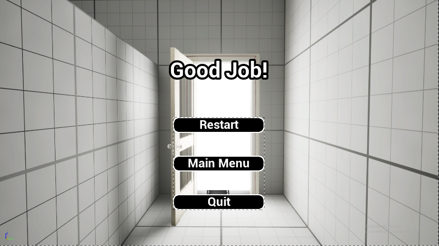
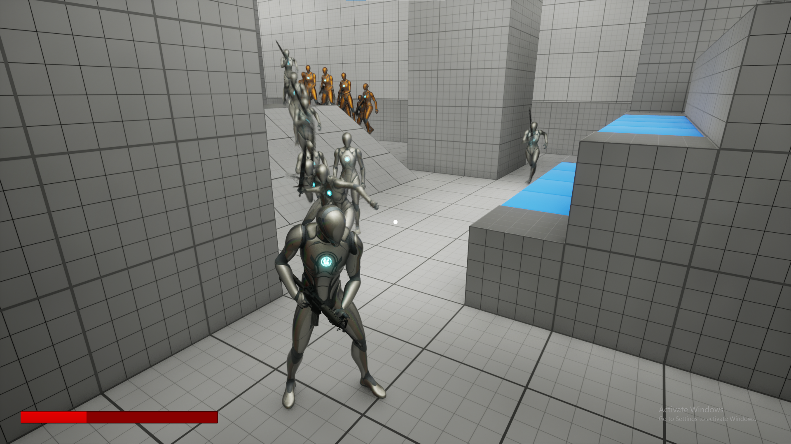

# ErrorCollisionMatrix
ErrorCollisionMatrix is a local Singleplayer game that revolves around the concept of walls that can be penetrated and be seen through, and levels filled with enemies
and puzzles.

## Overview
The player procceds throught a facility, going through levels and solving puzzles along the way. The player has to simultaneously stay alive from the onslaught of enemies, which becomes increasingly
harder as the level increases.

The player has a special ability to see through walls, helping them spot enemies and hidden items. This skill lets the player plan and act carefully to beat each level. The player can also shoot through walls, making it easier to take out enemies from hidden spots.

Throughout the game, the player will find tools in the environment that provide help and guidance, making it easier to figure out and complete each level.

## User Manual
- ### Installation: 
    Simply download the game files and launch ErrorCollisionMatrix.exe in the Game Folder
- ### Objective
    1. Escape the CollisionMatrix by reaching the door on the other side, filled with enemies with swords and guns aiming at you.
    2. Your gun can shoot through walls, and you can see through them. Use it to solve the puzzles in each level!
    
- ### Controls
    Basic controls for players:

    | ***Action***   |  ***Player*** | 
    |----------------|---------------|
    | Move Left      | A             |
    | Move Right     | D             |
    | Move Foward    | W             |
    | Move Backward  | S             |
    | Jump           | Space         | 
    | Shoot          | Left Click    | 
    | Aim            | Right Click   | 
- ### Environment Interactables
    Random Environment Interactables are scattered throughout the arena to help you proceed to the next level.

    | ***Interactables***           |          ***Effects***             |
    |-------------------------------|------------------------------------|
    | Jump Pad                      | Launch the Player Upwards          |
    | Speed Boost                   | Push the player towards arrow      |
    | Spike                         | Apply Damage to player if collided |
    | Movable Blocks                | Blocks can be pushed with bullets  |

## Acknowledgement
We would like to thank our lecturer for his guidance and support throughout the development of this project.

## References
- Game Assets from Itch.io: [https://itch.io/game-assets/](https://itch.io/game-assets/)
- Markdown Documentations: [https://www.markdownguide.org/basic-syntax/](https://www.markdownguide.org/basic-syntax/)

## Credits
- **[FilmCow SFX](https://filmcow.itch.io/filmcow-sfx)** by ***FilmCow***
- **[Music Loop Bundle](https://tallbeard.itch.io/music-loop-bundle)** by ***Tallbeard Studios***

## Group Members
### 1. Cham Hao Cheng (1211304951)
    - Game Design
    - Main Menu and End Screen (Play, Exit, Main Menu)
    - Player Behaviours and Character animations (Idle, Move, Jump, Aim, Shoot, Player Damage)
    - Level Design (Platform Layout, creation of Level 1, Level 2, Level 3, Level 4)
    - Puzzle Level Ideation (Level 1, Level 2, Level 3)
    - Environment Interactables ( Jump Pad, Spike, Speed Boost, Movable Boxes)
    - Camera Behaviours (Follow Players, Dynamic Zoom, Aiming zoom Mechanism)
    - Hitscan Mechanics  (Hit Enemy, enable Hitscan through walls)
    - Video Demo

### 2. Muhammad Lutfi Bin Mohd Izzat (1201100521)
    - Game Design
    - AI implementation (Melee Enemy, Ranged Enemy)
    - Melee enemy Implementations ( Patrol, Attack, Investigate, Death)
    - Ranged enemy Implementations ( Patrol, Shoot, Investigate, Death)
    - Write Documentations (README.md)
    - Find Game and Sound Assets 
    - SFX Design (Soundtrack, Player Sound Effects, Tool Sound Effects)
    - Screenshots and Video Demo
        
## Video Demo and Screenshots
Watch Video Demo on YouTube: [https://www.youtube.com/watch?v=Cr4FFt3VYT4](https://www.youtube.com/watch?v=Cr4FFt3VYT4)
<table>
  <tr>
    <td></td>
    <td></td>
  </tr>
  <tr>
    <td></td>
    <td></td>
  </tr>
  <tr>
    <td></td>
    <td></td>
  </tr>
</table>
